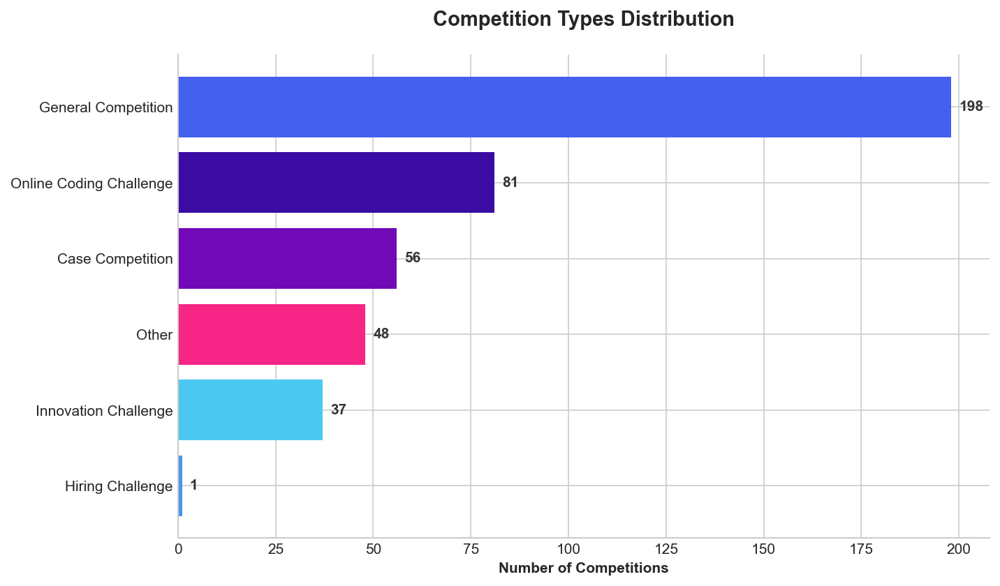
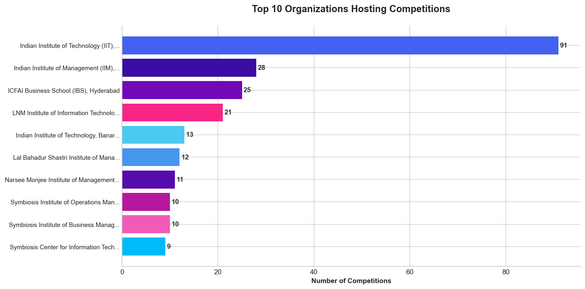
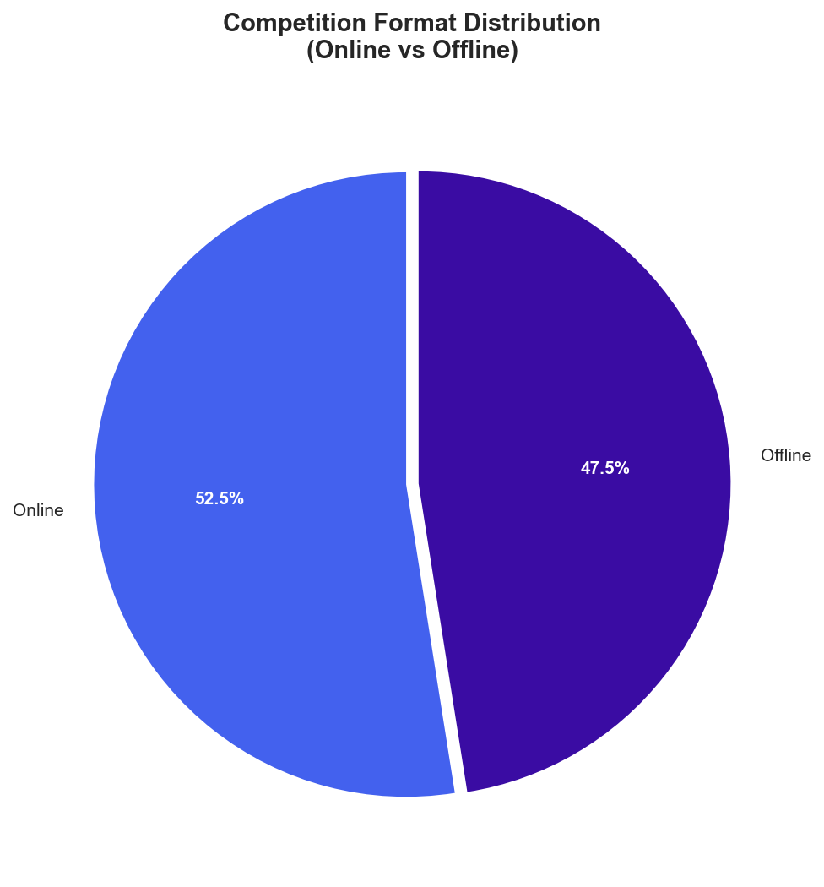
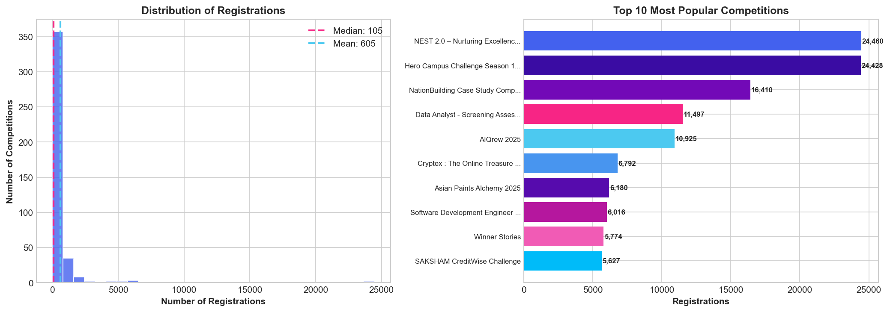
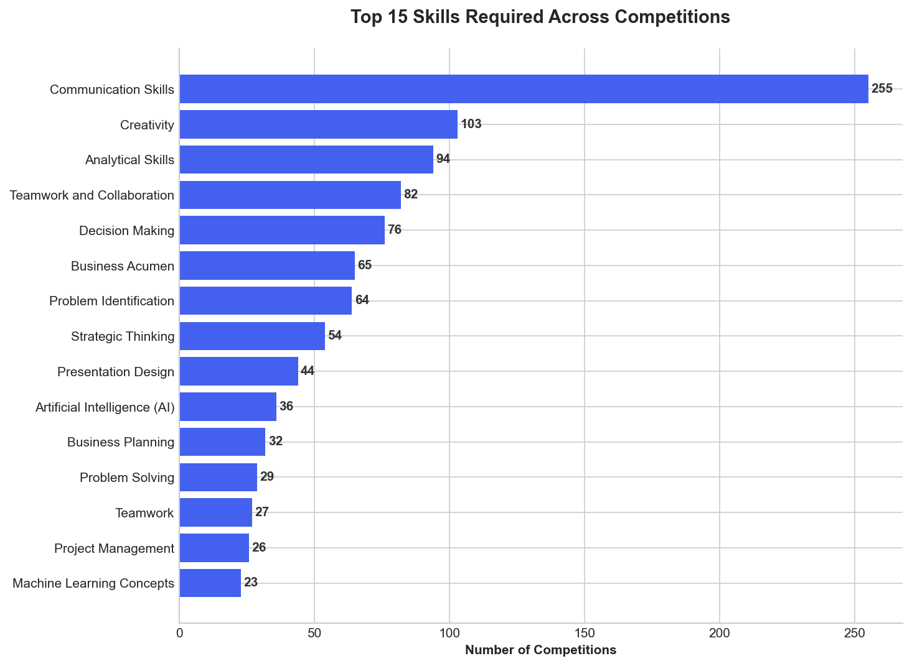
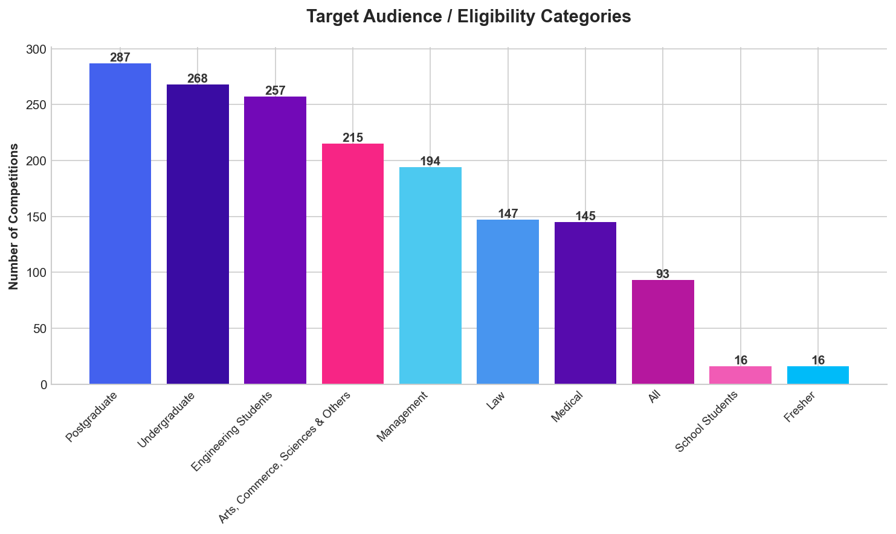
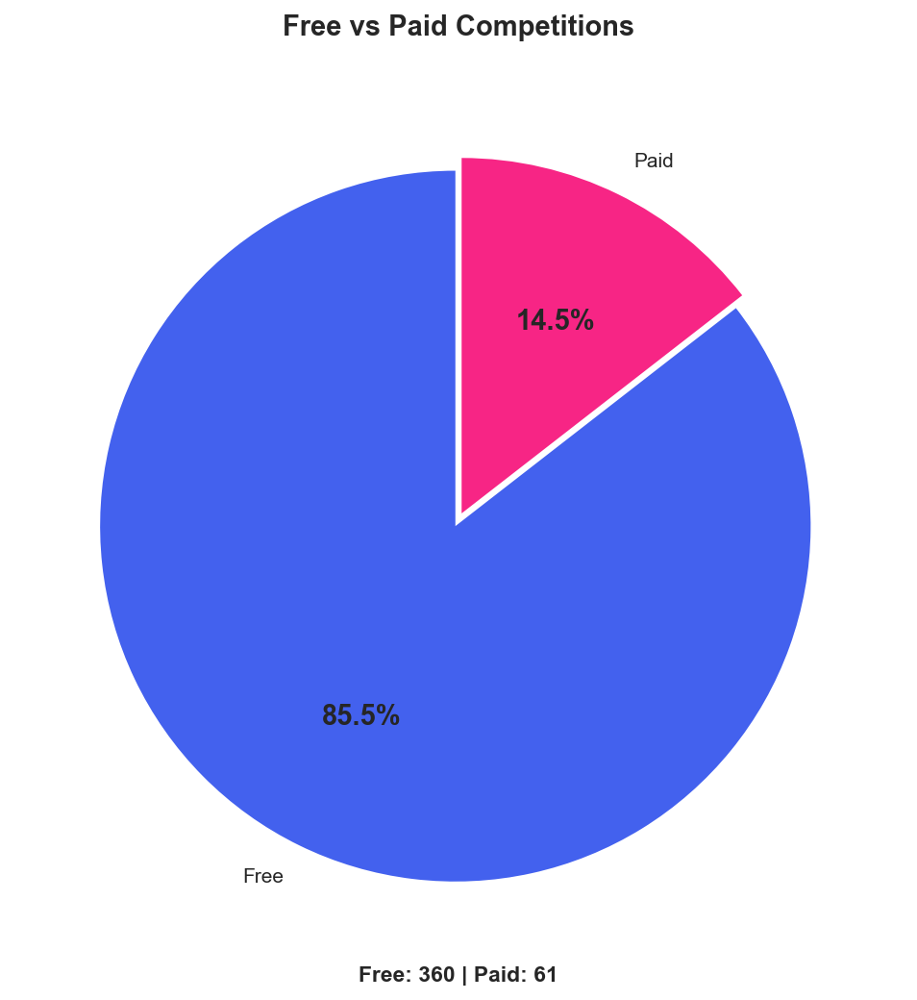
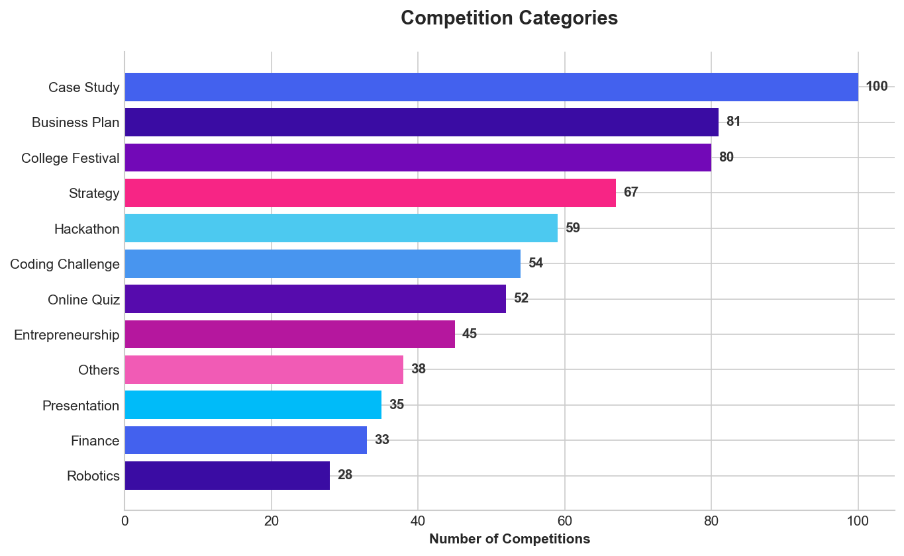
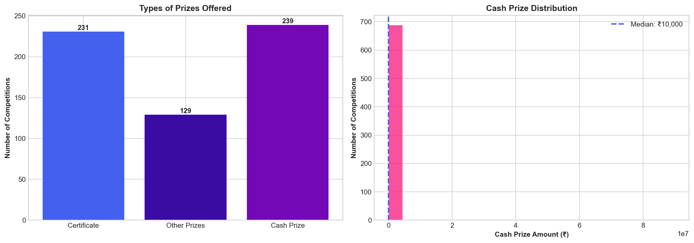

# Unstop Competitions Analysis

> Data-driven insights from **421 active competitions** on [Unstop.com](https://unstop.com)

---

## Overview Dashboard


### Key Metrics at a Glance

| Metric | Value |
|--------|-------|
| **Total Competitions** | 421 |
| **Total Registrations** | 200,000+ |
| **Unique Organizations** | 300+ |
| **Online Competitions** | 85%+ |
| **Free to Participate** | 95%+ |

---

## Competition Types

### What kinds of competitions are available?



**Key Insights:**
- **Online Coding Challenges** dominate the platform - ideal for remote participation
- **Ideathons** and **Case Competitions** follow closely, emphasizing problem-solving skills
- **Quizzes** offer quick, knowledge-based competition format
- Diverse formats cater to different skill sets: technical, analytical, and creative

---

## Top Organizations

### Who's hosting the most competitions?



**Key Insights:**
- Leading **IITs** (Bombay, Kharagpur, Delhi) are top competition hosts
- Mix of **premier institutes** and **corporate organizations**
- Strong presence of **NITs** and **engineering colleges**
- Organizations use competitions for talent discovery and brand building

---

## Competition Format

### Online vs Offline Distribution



**Key Insights:**
- Overwhelming preference for **online competitions** (~85%)
- Online format enables **pan-India and global participation**
- Offline competitions typically tied to fest events or finals
- Hybrid models gaining traction post-pandemic

---

## Registration & Popularity

### What makes a competition popular?



**Key Insights:**
- **Top competitions attract 5,000+ registrations**
- Median registration: ~150-200 participants per competition
- Long-tail distribution: few mega-popular, many niche competitions
- Brand recognition and prize pool significantly impact participation

---

## Skills in Demand

### What skills do competitions require?



**Key Insights:**
- **Communication Skills** rank highest - essential across all formats
- **Problem Solving** and **Analytical Thinking** are core competencies
- **Technical skills**: Programming, Data Science, Machine Learning
- **Soft skills** valued equally: Teamwork, Creativity, Leadership
- Competitions serve as skill validation platforms

---

## Target Audience

### Who can participate?



**Key Insights:**
- **Engineering students** are the primary target demographic
- Strong focus on **undergraduate** participants
- **MBA and management students** have dedicated competitions
- Open categories welcome **working professionals** and **freshers**
- Some competitions target specific years (1st/2nd year students)

---

## Pricing Model

### Free vs Paid Competitions



**Key Insights:**
- **95%+ competitions are FREE to participate**
- Paid competitions typically offer premium prizes or certifications
- Low barrier to entry encourages mass participation
- Revenue model focuses on organization partnerships, not participants

---

## Competition Categories

### Domain-wise Distribution



**Key Insights:**
- **Hackathons** lead the category charts
- **Quiz competitions** offer quick engagement opportunities
- **Business and Strategy** competitions popular among MBA aspirants
- **Creative and Design** categories cater to non-technical talent
- Emerging: **AI/ML** and **Blockchain** themed competitions

---

## Prize Structure

### What can winners expect?



**Key Insights:**
- **Certificates** offered in most competitions
- **Cash prizes** range from a few thousand to lakhs
- **Non-cash rewards**: Internships, PPIs, Goodies, Courses
- Top-tier competitions offer **Pre-Placement Opportunities**
- Median cash prize: ~10,000-20,000 INR

---

## Data Collection

### Methodology

- **Source**: Unstop.com Public API
- **Endpoint**: `/api/public/opportunity/search-result`
- **Scraping Method**: Async Python (aiohttp + asyncio)
- **Data Points**: 32 fields per competition
- **Date**: December 2025

### Files Generated

| File | Description | Size |
|------|-------------|------|
| `competitions.csv` | Flattened competition data | 3.5 MB |
| `competitions.json` | Raw JSON data | 5.0 MB |
| `scrape_competitions.py` | Async scraper script | 5 KB |
| `create_charts.py` | Visualization generator | 14 KB |

---

## Quick Start

```bash
# Install dependencies
pip install aiohttp matplotlib

# Scrape fresh data
python scrape_competitions.py

# Generate charts
python create_charts.py
```

---

## Key Takeaways

1. **Unstop is a major platform** for student competitions in India
2. **Engineering students** are the primary audience
3. **Online format dominates** - accessibility is key
4. **Free participation** drives high engagement
5. **Skill-based competitions** help validate and showcase talent
6. **IITs and corporates** are the biggest competition hosts
7. **Diverse formats** cater to technical and non-technical talent

---

## Future Scope

- Track competition trends over time
- Analyze success rates and winner profiles
- Build recommendation engine for participants
- Monitor prize pool inflation
- Study correlation between registration and prize amounts

---

<p align="center">
  <b>Data scraped on December 18, 2025</b><br>
  <i>421 Active Competitions Analyzed</i>
</p>
